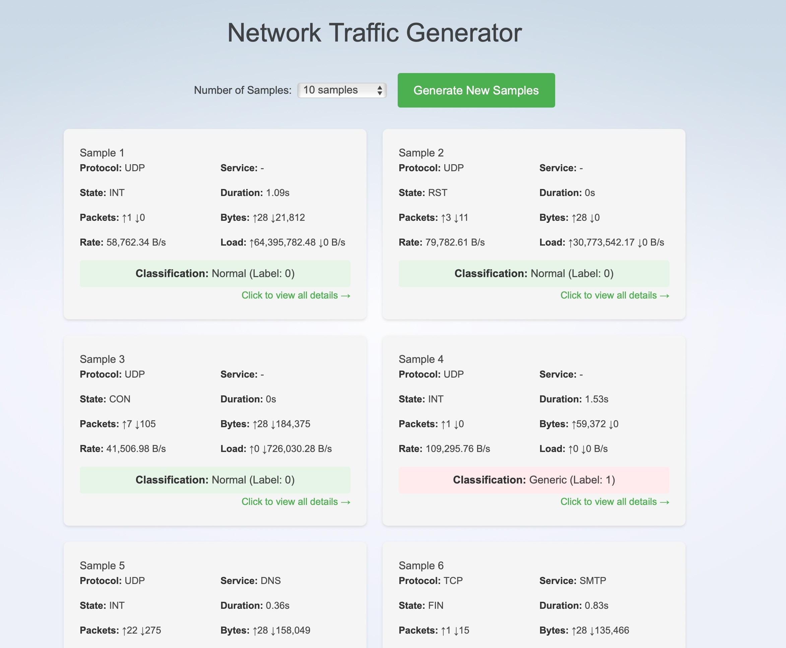
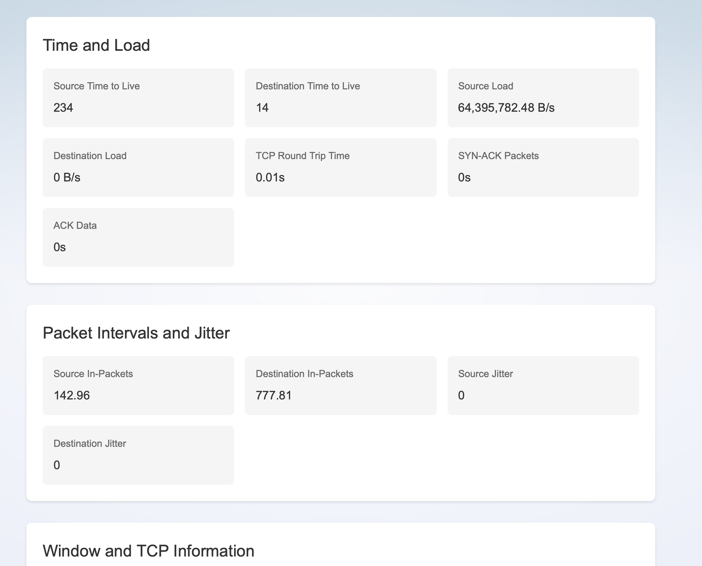
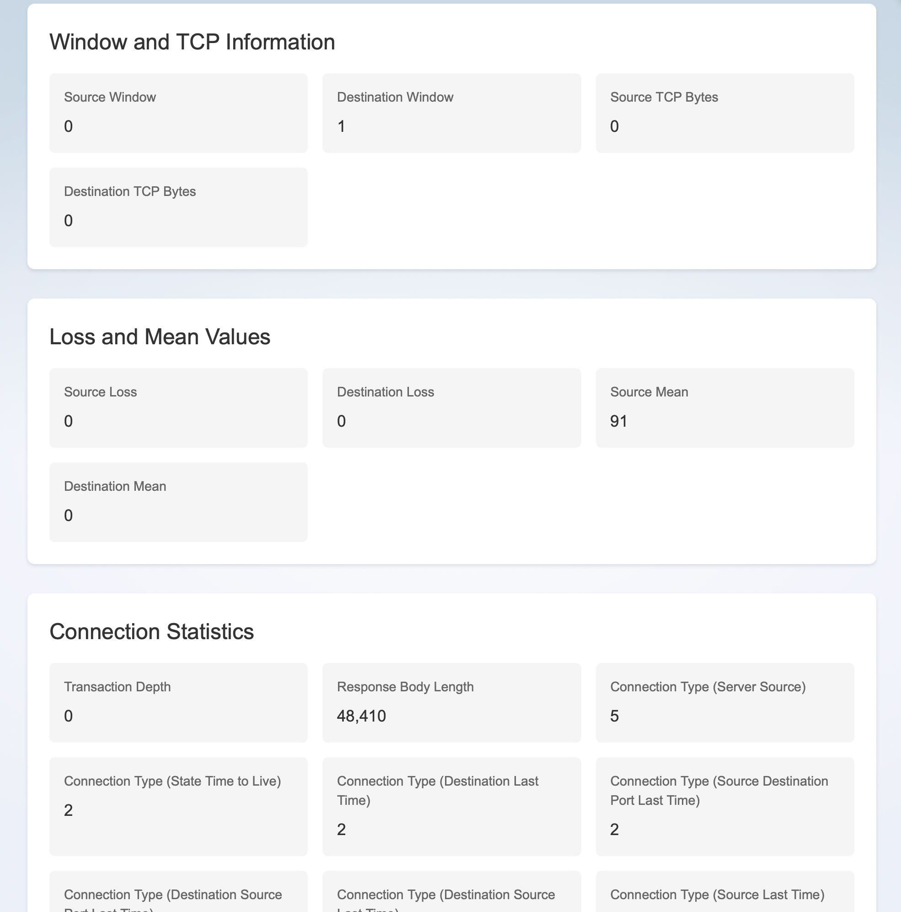

# GDM-NETWORK

## Windows

### Run AI

Install uv at <https://github.com/astral-sh/uv>

```pwsh
cd ai
uv venv
.venv/bin/activate.ps1
uv sync
flask --app main run
```

### Run FE

Install bun at <https://bun.sh/docs/installation>

```pwsh
cd fe
bun dev
```






